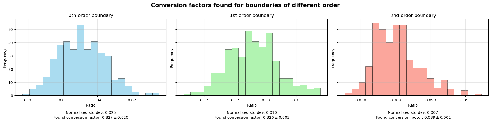

# 📃 Notebook: `conversion-factor-for-shape-index`

In this notebook, the conversion factor is sought to compare the shape-index computed by the perimeter-length $L$ and area $A$ as  
$$\rho = \frac{L}{\sqrt{A}}$$

with the perimeter computed by different orders of discrete neighbourhoods for two-dimensional shapes.

## 🎯 Goal

Let's say we have a **cellular Potts model** [1] simulation where the perimeter is computed for cells using the Moore neighbourhood of boundary pixels [2]. This perimeter cannot be used to determine the **shape-index** of the cells [3] directly. This perimeter is a count of the pixels that are part of the discrete boundary and therefore needs a conversion to the continuous (Euclidean) perimeter that can be computed in non-discrete cases. By comparing the perimeters calculated for random shapes that are continuous, and then discretizing these shapes into pixels and computing the Moore neighbourhood perimeter, we find a conversion factor that allows us to map one into the other. With this conversion factor we can determine a literature-consistent [3] shape-index for discrete shapes such as cellular Potts model cells.

## 🔧 Method

This notebook presents a pipeline to estimate conversion factors between continuous perimeters and discrete Moore-neighbourhood perimeters. The main steps are:

1. **Random shape generation**  
   - We generate random two-dimensional shapes using a truncated Fourier series.  
   - The Fourier coefficients are drawn from a normal distribution and random phase offsets are applied.  
   - The `fourier_series_order` and a `spikeyness_coefficient` control the complexity and amplitude of the shape.

2. **Continuous representation**  
   - A radial function $r(\theta)$ is obtained from the Fourier series, and is interpolated with a periodic cubic spline (`CubicSpline`, from `scipy`) to obtain a smooth representation of the boundary.  
   - Using the spline, the continuous area $A$ and boundary length $L$ are computed by numerical integration over $\theta$ using Simpson's rule [4].

3. **Discrete representation**  
   - The smooth shape we generated with the Fourier series is discretized onto a pixel grid.  
   - The discrete neighbourhood method for the perimeter is used to compute the perimeter for different boundary orders (single pixel, Moore neighbourhood (8 pixels), and a larger neighbourhood (20 pixels)).

4. **Statistics and conversion factor**  
   - For each random shape, we compute the continuous shape-index $\rho = \frac{L}{\sqrt{A}}$ and the corresponding discrete shape-index for the three different boundary orders.  
   - Repeating the experiment multiple times for different shapes produces distributions of the ratio between continuous and discrete shape-indices.  
   - The mean and standard deviation of these ratios are presented, where the mean is used as the empirical conversion factor.

## 💻 Code

The notebook can be found in the `./notebooks/` folder. The functions used in the notebook can be found in the `./src/` folder.

## 📊 Results

The notebook computes empirical conversion factors that map discrete perimeter-derived shape indices to continuous shape indices as used in the literature. Below is a summary of the results and their interpretation:

- **Conversion factor**: For each boundary order (0th, 1st, 2nd), we compute the mean of the ratio between the continuous shape-index and the discrete shape-index. The mean is reported in the histograms as the estimated conversion factor.
- **Approximation**: Both the absolute standard deviation and the normalized standard deviation (std / mean) for each ratio distribution are given. The normalized value provides a scale-independent measure of spread and is therefore *the* indicator for which discrete method is the most precise compared to the continuous case.
- **Recommendation**: As the 1st-order computation is implemented in current software [2], and it is found that the 2nd-order computation does not decrease the normalized standard deviation as much, the 1st-order Moore neighbourhood method seems to be the best to use. There seem to be dimishing returns in precision when increasing the computational cost (larger neighbourhoods).
- **Limitations**:  
  - **Grid resolution**: The conversion factor depends on the amount of pixels used in the discretized representation. Consider calibrating conversion factors for the cell sizes used in your data.  
  - **Shape ensemble**: The experiment samples random Fourier shapes. Conversion factors may differ for shape ensembles with very different statistics (e.g., highly elongated). Again, if these extreme regimes are relevant depends on your data.  
  - **Small-sample noise**: If the amount of samples is small, the mean and standard deviation estimates will be noisy. Increase the `samples`-parameter for better estimates.

## 📚 References

[1] The paper that introduced the model: [Simulation of biological cell sorting using a two-dimensional extended Potts model](https://doi.org/10.1103/PhysRevLett.69.2013), by François Graner and James A. Glazier.

[2] This is a method used in many cellular Potts model implementations. For example: [Morpheus](https://morpheus.gitlab.io/), [Artistoo](https://artistoo.net/), [gpu-cpm](https://arxiv.org/abs/2312.09317).

[3] A paper where this quantity is relevant for cells is: [Role of cell deformability in the two-dimensional melting of biological tissues](https://journals.aps.org/prmaterials/abstract/10.1103/PhysRevMaterials.2.045602), by Yan-Wei Li and Massimo Pica Ciamarra.

[4] An established numerical integration method. See: [Wikipedia](https://en.wikipedia.org/wiki/Simpson%27s_rule).

## 🔎 Further reading

See the following paper for more information about cellular Potts model neighbourhood choices (like the Moore neighbourhood): [The biophysical nature of cells: potential cell behaviours revealed by analytical and computational studies of cell surface mechanics](https://doi.org/10.1186/s13628-015-0022-x), by Ramiro Magno, Verônica A Grieneisen & Athanasius FM Marée.
